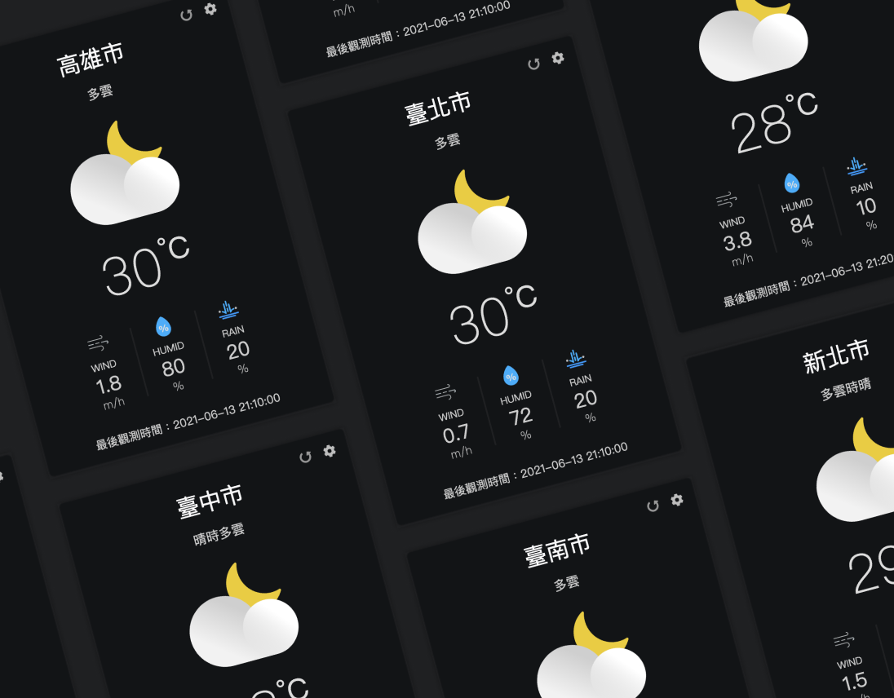
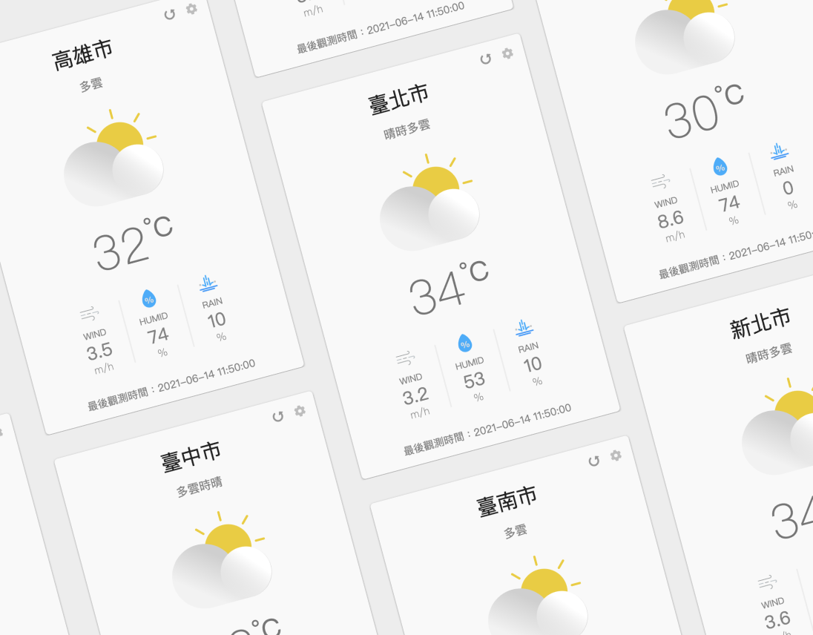

本專案環境是透過 [Create React App](https://github.com/facebook/create-react-app) 所建立。

# The Good Weather
這是一個觀測全台各縣市即時天氣的部件，主要使用 React 與 Redux 作為開發工具。如有興趣，可至 https://yuentung.github.io/weather/ 查看線上版本。

<div>
    
    
</div>

## 啟動專案
```shell
$ git clone https://github.com/yuentung/weather.git
$ cd weather
$ npm install && npm start (或使用 yarn && yarn start)
```

## 專案架構
以下主要針對 src 資料夾做介紹：
```
src
├── components
│   └── Parameter.js
│   └── WeatherIcon.js
│   └── WeatherSetting.js
│   └── WeatherCard.js
│   └── App.js
├── constants
│   └── sunrise-sunset.json
│   └── index.js
├── images
├── hooks
├── apis
├── history.js
├── styles.css
└── index.js
```
依照不同功能及需求創建資料夾與檔案：
- `/components`：放置所有元件
- `/constants`：放置所有 `不會更改` 的資訊，包含：
    - `sunrise-sunset.js`：存放各地區日出、日落時間資訊
    - `index.js`：存放各地區名稱
- `/images`：放置所有圖片
- `/hooks`：放置 custom hooks
- `/apis`：放置所有 API
- `history.js`：放置 history 物件
- `styles.css`：設定全域 CSS
- `index.js`：為本專案的 entry point

## 使用工具
- [React](https://reactjs.org/)

    除了運用 React 中兩大主要概念——元件(component)與狀態(state)建構專案外，同時嘗試使用各個 Hooks。

- [React Router](https://reactrouter.com/)

    使用 React Router 建立路由，分別切換顯示 `WeatherCard(天氣資訊)` 與 `WeatherSetting(選擇地區)` 兩元件，以此達成於 SPA 中進行頁面切換的效果。

- [Emotion](https://emotion.sh/docs/introduction)

    透過 Emotion 以 CSS-in-JS 的方式建立附帶樣式的 React 元件，除了能夠以熟悉的撰寫方式設定 CSS 取代 Inline Style 中 style 物件的寫法外，還可以透過 props 對各元件進行客製化的設定。

- [Axios](https://axios-http.com/)

    藉由 Axios 發送請求，以取得中央氣象局中各地區的即時天氣資訊。

## 未來發展
- [ ] 持續擴增功能，如提供更多即時天氣資訊等